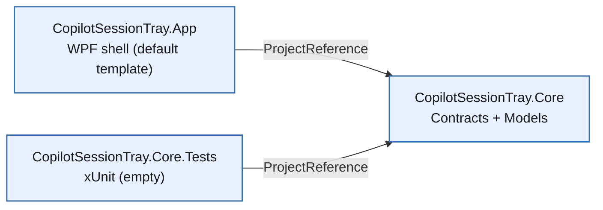
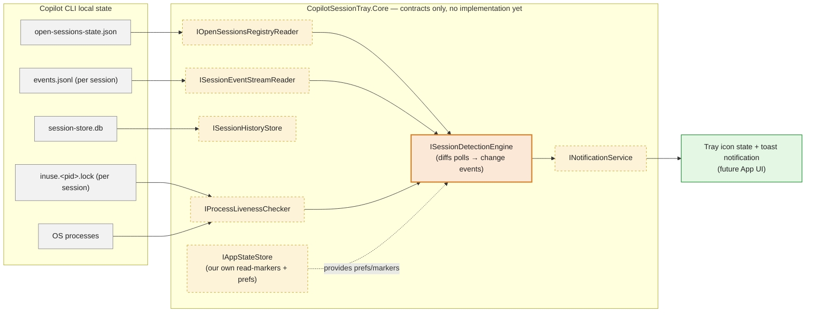

# Architecture (high level, Phase 0.5)

> Open this file with **Markdown Preview** in VS Code (`Ctrl+Shift+V`, or right-click
> the tab → "Open Preview") to render the diagram below. VS Code renders Mermaid
> natively in Markdown Preview (no extension needed on recent versions). If it
> doesn't render, paste the code block into <https://mermaid.live> instead.

## 1. Solution structure

Which project depends on which — this part is fully built and compiles today.

## 2. Data flow through Core (the actual design)

Read left → right as a pipeline: raw Copilot CLI files/processes are read by
dedicated contracts, funneled into the detection engine (the "brain"), which
drives notifications and, eventually, the tray UI. **Yellow/dashed = interface
only, no implementation yet.** Orange = the most important piece to review
closely. Green = the end-user-visible payoff this whole pipeline exists for.

**Models** (`OpenSessionEntry`, `SessionEventRecord`, `SessionSummary`,
`SessionTurn`, `SessionCheckpoint`, `SessionReadMarker`,
`NotificationPreferences`, `SessionChangeEvent`, `SessionNotification`,
plus the `SessionStatus`/`SessionEventKind`/`SessionChangeKind` enums) are
omitted above for clarity — they're just the plain data shapes each
contract above passes around; see `src/CopilotSessionTray.Core/Models/`.

Matches the Phase 0.5 status described in
[`IMPLEMENTATION_PLAN.md`](./IMPLEMENTATION_PLAN.md).
