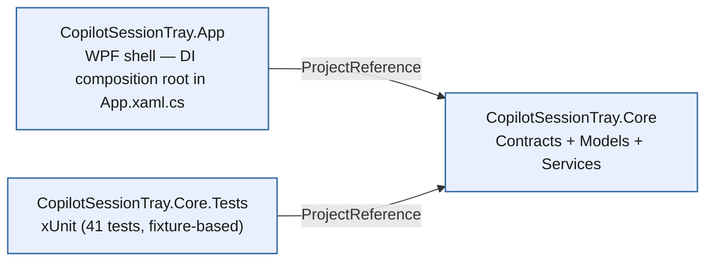
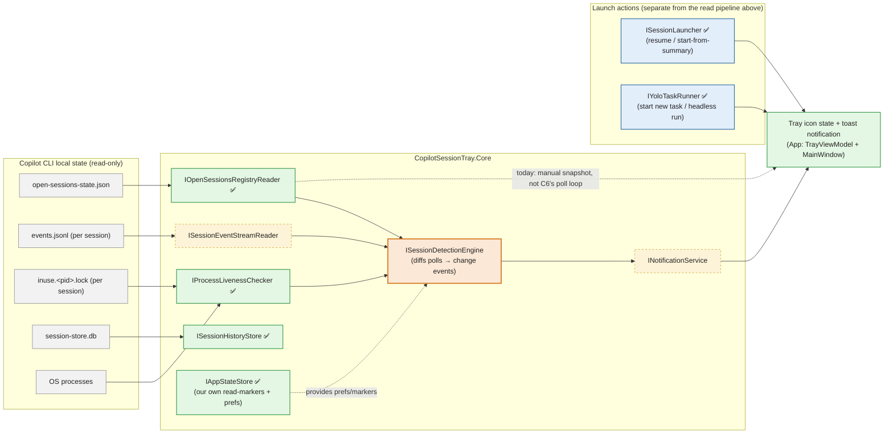

# Architecture (high level)

> Open this file with **Markdown Preview** in VS Code (`Ctrl+Shift+V`, or right-click
> the tab → "Open Preview") to render the diagram below. VS Code renders Mermaid
> natively in Markdown Preview (no extension needed on recent versions). If it
> doesn't render, paste the code block into <https://mermaid.live> instead.

## 1. Solution structure

Which project depends on which — this part is fully built and compiles today.

```mermaid
flowchart LR
    Core["CopilotSessionTray.Core<br/>Contracts + Models + Services"]
    App["CopilotSessionTray.App<br/>WPF shell — DI composition root in App.xaml.cs"]
    Tests["CopilotSessionTray.Core.Tests<br/>xUnit (41 tests, fixture-based)"]

    App -->|ProjectReference| Core
    Tests -->|ProjectReference| Core

    classDef proj fill:#E8F0FE,stroke:#3A6EA5,stroke-width:1.5px,color:#1a1a1a
    class Core,App,Tests proj
```

## 2. Data flow through Core (the actual design)

Read left → right as a pipeline: raw Copilot CLI files/processes are read by
dedicated contracts, funneled into the detection engine (the "brain"), which
drives notifications and the tray UI. **Green = real, working implementation
today. Yellow/dashed = interface only, not implemented yet — Phase 3/4.**
Orange = the most important remaining piece to implement carefully (the
detection engine directly shapes whether the app's core promise — "tell me
when a session finishes" — actually works). Blue = the app-facing launch
actions (resume/start task), a separate concern from the read-only pipeline
above them; also real and working today.

```mermaid
flowchart LR
    subgraph SRC["Copilot CLI local state (read-only)"]
        direction TB
        S1["open-sessions-state.json"]
        S2["events.jsonl (per session)"]
        S3["inuse.&lt;pid&gt;.lock (per session)"]
        S4["session-store.db"]
        S5["OS processes"]
    end

    subgraph CORE["CopilotSessionTray.Core"]
        direction TB
        C1["IOpenSessionsRegistryReader ✅"]
        C2["ISessionEventStreamReader"]
        C3["ISessionHistoryStore ✅"]
        C4["IProcessLivenessChecker ✅"]
        C5["IAppStateStore ✅<br/>(our own read-markers + prefs)"]
        C6["ISessionDetectionEngine<br/>(diffs polls → change events)"]
        C7["INotificationService"]
    end

    subgraph LAUNCH["Launch actions (separate from the read pipeline above)"]
        direction TB
        L1["ISessionLauncher ✅<br/>(resume / start-from-summary)"]
        L2["IYoloTaskRunner ✅<br/>(start new task / headless run)"]
    end

    OUT["Tray icon state + toast notification<br/>(App: TrayViewModel + MainWindow)"]

    S1 --> C1
    S2 --> C2
    S4 --> C3
    S3 --> C4
    S5 --> C4

    C1 --> C6
    C2 --> C6
    C4 --> C6
    C5 -.provides prefs/markers.-> C6
    C6 --> C7
    C7 --> OUT
    C1 -.today: manual snapshot, not C6's poll loop.-> OUT
    L1 --> OUT
    L2 --> OUT

    classDef src fill:#F2F2F2,stroke:#888888,color:#222222
    classDef done fill:#E4F7E4,stroke:#3A9B4C,stroke-width:1.5px,color:#222222
    classDef iface fill:#FDF3D8,stroke:#C9A227,stroke-width:1px,stroke-dasharray: 4 4,color:#222222
    classDef brainNode fill:#FCE8D6,stroke:#D9822B,stroke-width:2.5px,color:#222222
    classDef launch fill:#E3EEFB,stroke:#2E6DA4,stroke-width:1.5px,color:#222222
    classDef out fill:#E4F7E4,stroke:#3A9B4C,stroke-width:1.5px,color:#222222

    class S1,S2,S3,S4,S5 src
    class C1,C3,C4,C5 done
    class C2,C7 iface
    class C6 brainNode
    class L1,L2 launch
    class OUT out
```

Note the dashed line straight from `C1` to `OUT`: today's "live" tray view
(`TrayViewModel.LoadLiveSessionsScenarioAsync`) reads `IOpenSessionsRegistryReader`
directly and renders a one-shot snapshot on demand (the "Cycle demo data"
button) — it does **not** yet go through `ISessionDetectionEngine`'s
poll/diff loop, since that engine isn't implemented yet. That loop, plus
`ISessionEventStreamReader` and `INotificationService`, are Phase 3/4's job;
building them is expected to change how `TrayViewModel` gets its data
(incremental diffs applied to `Sessions`, not the current clear-and-rebuild
snapshot) — see IMPLEMENTATION_PLAN.md §10 Phase 3 and §9.1's notes on this.

**Models** (`OpenSessionEntry`, `SessionEventRecord`, `SessionSummary`,
`SessionTurn`, `SessionCheckpoint`, `SessionReadMarker`,
`NotificationPreferences`, `SessionChangeEvent`, `SessionNotification`,
`YoloTaskResult`, plus the `SessionStatus`/`SessionEventKind`/`SessionChangeKind`
enums) are omitted above for clarity — they're just the plain data shapes
each contract above passes around; see `src/CopilotSessionTray.Core/Models/`.
`SessionLockFileInspector` (used by `C4`'s liveness cross-referencing today)
is also omitted — deliberately not one of the reviewed contracts; see its
own doc comment.

See [`IMPLEMENTATION_PLAN.md`](./IMPLEMENTATION_PLAN.md) §9.1/§10 for the
full up-to-date status, including a 2026-09-29 design-review pass and how
each finding was resolved.
